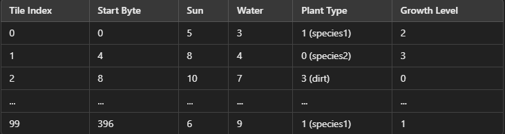

# Cmpm-121-Final-Project

**Tools Lead (Max):** They will research alternative tools, identify good ones,
and help every other team member set them up on their own machine in the best
configuration for your project. This person might also establish your team’s
coding style guidelines and help peers setup auto-formatting systems. This
person should provide support for systems like source control and automated
deployment (if appropriate to your team’s approach).

**Engine Lead (Jason):** They will research alternative engines, get buy-in from
teammates on the choice, and teach peers how to use it if it is new to them.
This might involve making small code examples outside of the main game project
to teach others. The Engine Lead should also establish standards for which kinds
of code should be organized into which folders of the project. They should try
to propose software designs that insulate the rest of the team from many details
of the underlying engine.

**Design Lead (Elton):** They will be responsible for setting the creative
direction of the project, and establishing the look and feel of the game. They
might make small art or code samples for others to help them contribute and
maintain game content. Where the project might involve a domain-specific
language, the Design Lead (who is still an engineer in this class) will lead the
discussion as to what primitive elements the language needs to provide.

# Tools and Materials

The engine that we plan on using is a phaser. At first, we were fine with
whatever but we ended up with phaser. The main reason why we decided to choose
the phaser is because we are somewhat familiar with it as CMPM 120 taught us how
a phaser works which would make it feasible to make something with the given
time constraints.

We plan on using JSON and Javascript as Phaser already supports the programming
and data languages. As it stands there might be an off chance that we’ll use
another data language but we’re most likely going to stick with JSON.

The tool we plan on using is Github (of course) to work on the project. We will
also use whatever IDE the three of us prefer to use. As for making the game
assets, we could make our own or use free ones on the internet while making sure
to credit them. A possible one that we would use is possibly Kenny Assets.

For our alternate platform choice, we would use typescript. The reason why is
that it was an example given in the lecture and typescript is something we used
all quarter so it would most likely be easier on us when we have to convert our
game.

# Outlook

One of the main challenges we see for this project is the fact multiple people
with different code styles. The topics we have learned in this class will
definitely help with this but we are still apprehensive since most of the coding
we have done has been as individuals. This is also our main focus on this
project, to maintain a consistent code style across the whole project so we can
all understand what is happening in the game itself. This will prepare us to
work with anyone in the industry, and potentially teach us how to change our own
code style or at least tweak it to match other people’s code styles. The main
focus for us will be teamwork and making sure everyone can work efficiently and
consistently, this will enable us to make a fun and interactive game without a
lot of the pain and suffering that come with debugging. There will still be a
focus on making the game fun and entertaining, however, similar to the class,
the main focus will be on code style and code smells. We might also try to find
a way to support controllers within our game as it will help people that are
unable to use keyboard and mouse due to limitations with their body

# F0 Devlog

# How we satisfied the software requirements

* [F0.a] - 
We created a 2d grid using tiles in Phaser, we made a randomizer, that spits out a randomized array of tiles that makes a board with plants everywhere. 
We then used cursor.is.down on the arrow keys so the player is able to move around, up, down, left, and right.

* [F0.b] - 
We implemented a manual time that is turn-based by making it so that every 3 steps the player takes a flower will appear. 
This simulates a turn-based as every player has as much time as they want every turn to play their next turn.

* [F0.c] -
We made it so that when you press the space bar you reap a plant. 
The plant gets removed from the plot, one space bar press will remove the plan on the grid you are currently on.

* [F0.d] -
We implemented the water levels by randomly generating a number 1-10 every turn, the number then gets added to the water number and the water number will just keep increasing. 
Furthermore, the sun level is randomly generated but not added to the value, the value gets reassigned every turn based on what the randomizer came up with.  

* [F0.e] -
We implemented 3 different growth levels by making a function that checks the water and sun levels, and if there are neighboring plants, and increments them accordingly. 
Additionally, we added plant types that get assigned to the plants when they are created. 

* [F0.f] - 
Simple spatial rules govern plant growth based on sun, water, and nearby plants (growth is unlocked by satisfying conditions).
We made the growth by making a function that checks the nearby tiles for plant growth, in addition to whether there is sun and water.  
If the value for the sun level is greater than 5, the value for the water level is 5, and a number of adjacent plants is greater than or equal to 2. Then the the growth factor will grow by one. 

* [F0.g] - 
We made it so that once all the flowers on the screen were gone, the game ended and you won. 
The whole point is to make sure all the flowers die, and can no longer grow back.

# Reflection
For our tools and materials, we are staying with Phaser and JavaScript and moving to Typescript and Deno. As for roles, we’re working perfectly fine. 
For F0, we split the work evenly between us 3. This made it so that we worked on F0 on our own time. This made it hard for us to make everything work all at once. 
We eventually solved it after several iterations of fixing it. 

# F1 Devlog

# How we satisfied the software requirements

* [F0.a] - same as last week

* [F0.b] - We increased the turn to 5 and the growth level of all plants would increase.

* [F0.c] - We made it so that you can only reap when the growth level of a plant is level 3

* [F0.d] - same as last week

* [F0.e] - Added the actual "sprites" of the 3 types of species

* [F0.f] - same as last week

* [F0.g] - We made it so that instead of clearing all the species, you would need to reap a certain amount of them to win

* [F1.a] - 
We implemented our game state as an Structure-of-Arrays (SoA) byte array format. The grid data is stored in a single contiguous Uint8Array, and each type of grid attribute (e.g., sun level, water level, plant type, and growth level) is encoded separately in specific offsets within the array. 

* [F1.b] - 
The player can choose to manually save their game state in either slot 1 or 2 by pressing keyboard keys 1 or 2.

* [F1.c] - 
The game calls the auto-save function every 4 steps.
On startup, the game checks if an auto-save entry is present by calling the checkAutoSave method.
If an auto-save entry is found, the game prompts the player with a confirmation dialog:
"Do you want to continue where you left off?"
If the player agrees, the game loads the auto-save state using the loadGame method.

* [F1.d] - 
The player can press z to undo or y to redo actions.

# Reflection

For our tools and materials, it has pretty much stayed the same. Besides that, the code we wrote had to be almost entirely revamped due to the making of an array structure which did end up making our code more optimized. Because of the revamp, it was hard for us to reimplement all of f0 back into our game. Luckily, we were able to do that and it turned out to work perfectly fine once we made our array sutrcture. Overall, we didn't believe that changing our roles was neccessary but it was definitely harder than last week as we only ended up with very little of the original code from f0.

# F2 Devlog

# How we satisfied the software requirements

Work in progress
